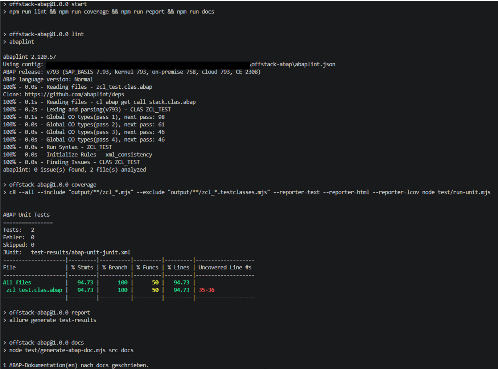

# Off-stack ABAP development

This repo serves as a demonstration for off-stack ABAP development. Developing ABAP code without access to an ABAP system. The project depends on [abaplint](https://github.com/abaplint/abaplint) and [transpiler](https://github.com/abaplint/transpiler) as well as related work like [open-abap](https://github.com/open-abap).

## Description

A sample ABAP class and Unit Test are in folder src/. The class has one method (add) that returns the sum of two input integers. An ABAP unit test class tests the method. The method add_test is not tested. It serves to demonstrate the unit and coverage feature. The ABAP code can be transpiled to JavaScript and run as a Node.js application. The unit tests can be executed and the results of the test run and code coverage captured. Additionally, the ABAP Doc comments can be transformed to a web page.

Running the app will transpile ABAP code to JavaScript, run unit tests and capture code quality data and generate reports.



Files generated:

- test-results/abap-unit-junit.xml: The unit report (xml)
- docs/index.html: ABAP Doc as HTML
- coverage/lcov.info: Coverage data
- coverage/index.html: Coverage report as HTML
- allure-report/index.html: ABAP Unit test run as Allure report

## Installation

Get the source code: either clone the repo, or download it as a zip and unzip it locally. Ensure that you have Node.js LTS installed.

The project is a Node.js app. It uses abaplint to lint and transpile ABAP code. Allure and c8 are used for code quality reporting.

```sh
npm ci
```

## Run app

To run all tasks and to get from ABAP code to final reports, run npm start.

```sh
npm start
```

## Available Tasks

The tasks available can be used to check the ABAP coding, transform it to JavaScript, run it and the unit tests, as well as capture code quality metrics and reports.

1) **Linting**

Validate the ABAP coding using abaplint.

> ```sh
> npm run lint
> ```

2) **Transpile**

Generate JavaScript code out of the ABAP code.

> ```sh
> npm run transpile
> ```

The generated JavaScript sources can be found in folder output/

3) **Unit tests**

> ```sh
> npm run test
> ```

4) **Capture unit test data**

> ```sh
> npm run test:unit
> ```

5) **Generate unit test report**

> ```sh
> npm run report
> ```

Display the generated HTML site in a web browser to see the report.

6) **Get code coverage data**

> ```sh
> npm run coverage
> ```

Open coverage/index.html in a web browser to see the report. Use lcov.info in your IDE or tool of choice to display the coverage data in an editor.

7) **Generate ABAP doc report**

> ```sh
> npm run docs
> ```

Open docs/index.html to access the report in a browser.
